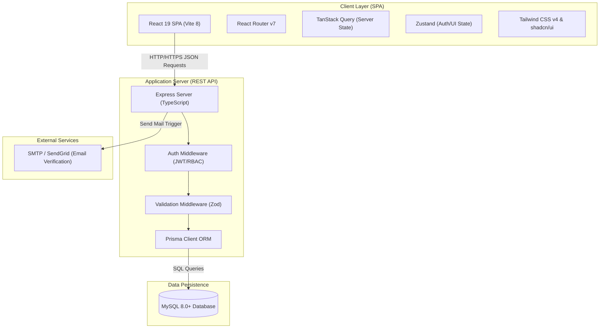
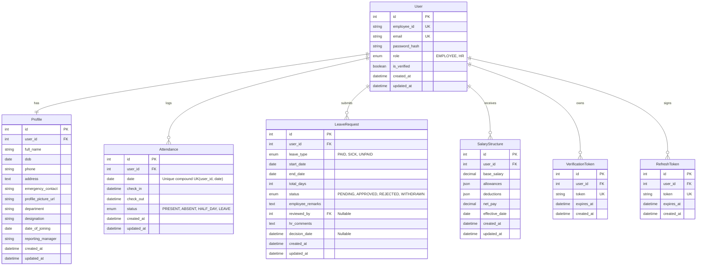
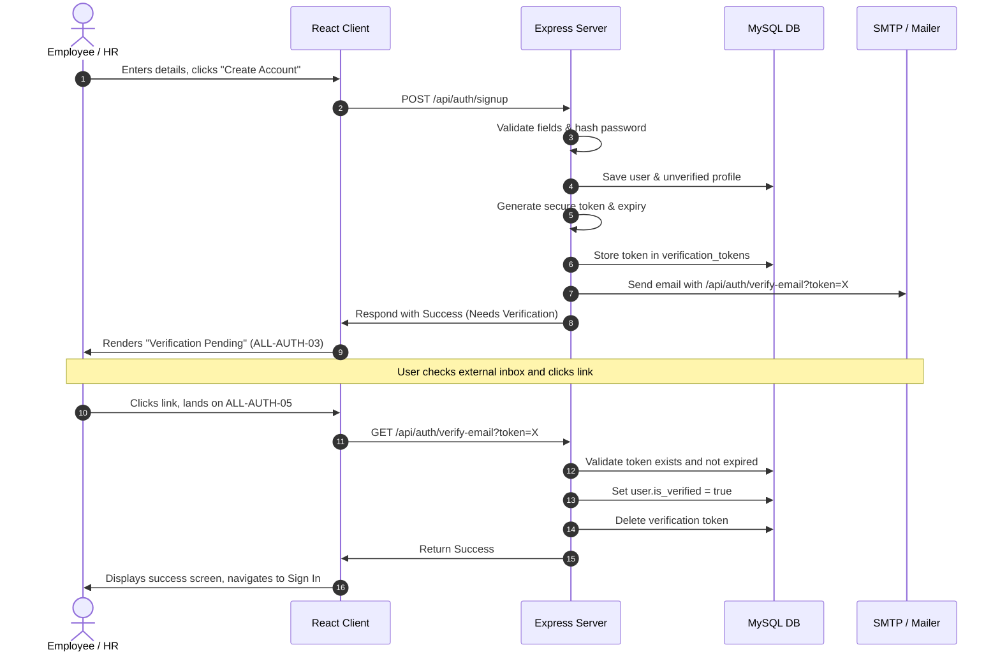
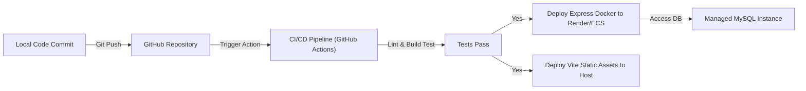

# Technical Requirements Document (TRD)
## Human Resource Management System (HRMS)

**Document Owner:** Senior Software Architect  
**Status:** Approved  
**Last Updated:** July 4, 2026  
**Reference Docs:** [PRD (PRD.md)](./PRD.md) | [Design Spec (DESIGN.md)](./DESIGN.md) | [App Flow (FLOW.md)](./FLOW.md)

---

## 1. Executive Summary & System Architecture

The Human Resource Management System (HRMS) is designed as a decoupled, role-based client-server application. It delivers a fast, responsive, and secure experience for employees and HR administrators. 

### High-Level System Topology



---

## 2. Technology Stack & Environment

The stack is curated based on the project's existing codebase configurations, performance requirements, and type-safety rules.

### 2.1 Frontend Stack

| Technology | Version | Purpose | Architectural Justification |
| :--- | :--- | :--- | :--- |
| **React** | `^19.2.6` | Core UI Framework | Utilizes React 19's improved rendering, concurrent features, and streamlined hook syntax. |
| **Vite** | `^8.0.0` | Frontend Tooling & Bundler | Provides near-instant hot module replacement (HMR) and optimized rollup production bundles. |
| **React Router** | `^7.18.1` | Client Routing | Handles declarative client-side routes, nested layouts (`AppLayout`), and role-based route guards. |
| **Tailwind CSS** | `^4.0.0` | Styling Engine | Modern CSS-first engine. Highly performant utility framework conforming to the design spec. |
| **shadcn/ui & Radix** | `^4.12.0` | Unstyled / Primitives | Ensures accessible, high-quality component bases (dialogs, tables, dropdowns). |
| **TanStack Query** | `^5.x` | Server State Management | Automatically handles cache invalidation, background re-fetching, and skeleton loading states. |
| **Zustand** | `^4.x` | Global Client State | A lightweight, fast state store for managing authentication tokens, user info, and theme settings. |
| **Lucide React** | `^1.23.0` | Icon Library | Clean, scalable vector icons matching the minimalist UI aesthetic. |

### 2.2 Backend Stack

| Technology | Version | Purpose | Architectural Justification |
| :--- | :--- | :--- | :--- |
| **Node.js** | `v20+ (LTS)` | JavaScript Runtime | Reliable runtime offering native fetch, stable performance, and wide package support. |
| **Express** | `^4.19.2` | Web Framework | Lightweight, modular framework suited for building RESTful micro-routes and middleware. |
| **TypeScript** | `^5.5.2` | Core Language | Guarantees compile-time type checking and shares data contract interfaces with the React client. |
| **Prisma ORM** | `^5.x` | Database ORM | Offers type-safe queries, automated migrations, and schema modeling for MySQL. |
| **Zod** | `^3.x` | Schema Validation | Validates incoming payloads at runtime, matching types with TypeScript definitions. |
| **bcryptjs** | `^2.4.3` | Cryptography | Secure password hashing using slow-evaluation salted algorithms. |
| **jsonwebtoken**| `^9.0.2` | Session Management | Generates and verifies state-independent stateless access tokens. |

### 2.3 Database

- **MySQL 8.0+**: Selected for its ACID compliance, fast index lookups, robust handling of relational structures (e.g. mapping profiles to users, and user logs to attendance), and enterprise-ready support in managed cloud environments.

---

## 3. Database Schema Design (MySQL)

Using Prisma as the ORM, the database schemas are mapped relationally. All tables utilize auto-incrementing integer IDs or random UUIDs as primary keys, standard timestamps for record history, and foreign keys with strict referential integrity rules.



### Table Definitions (Dotted SQL Spec)

1. **`users` Table**
   - Stores core account credentials, application roles, and verification states.
   - Index on `employee_id` and `email` for rapid authentication lookups.

2. **`profiles` Table**
   - Holds extended personal and professional details.
   - Linked to `users` via `user_id` with an `ON DELETE CASCADE` rule.

3. **`attendance` Table**
   - Logs daily attendance timestamps.
   - A unique compound key is placed on `(user_id, date)` to enforce a single attendance record per employee per day.

4. **`leave_requests` Table**
   - Manages leave lifecycle data.
   - `reviewed_by` links back to the HR Administrator's user record (nullable until processed).

5. **`salary_structures` Table**
   - Keeps track of base and detailed earnings/deductions.
   - `allowances` and `deductions` are stored as JSON arrays containing objects `(label: string, amount: number)` to support dynamic updates.

6. **`verification_tokens` & `refresh_tokens` Tables**
   - Verification tokens confirm accounts. Refresh tokens support persistent web sessions and token rotation policies.

---

## 4. Authentication & Authorization Flow

### 4.1 Token-Based Cookie Authentication
To balance modern frontend scalability with enterprise-grade security, the system utilizes stateless JWTs exchanged via **HTTP-only, Secure, SameSite=Strict cookies**. This eliminates risk vectors associated with local storage tokens (such as XSS script injections).

- **Access Token**: Short-lived JWT (15 minutes). Sent in a `SameSite=Strict` cookie.
- **Refresh Token**: Long-lived JWT (7 days). Stored in the database to support active session revocation and token rotation.

### 4.2 Email Verification & Onboarding Workflow

The following sequence diagram outlines registration, token-generation, and activation:



### 4.3 Authorization & Role-Based Access Control (RBAC)

Middlewares on the Express backend dynamically enforce roles. For every endpoint requiring validation, the handler extracts the user profile from the verified JWT cookie and checks the role:

```typescript
// Express RBAC Middleware Example
export const requireRole = (allowedRoles: string[]) => {
  return (req: Request, res: Response, next: NextFunction) => {
    const userRole = req.user?.role; // Extracted during verifyToken middleware
    if (!userRole || !allowedRoles.includes(userRole)) {
      return res.status(403).json({
        error: "Forbidden",
        message: "You do not have permission to access this resource."
      });
    }
    next();
  };
};
```

---

## 5. API Design & Endpoint Specification

All endpoints utilize standard JSON formats, input validation, and HTTP status codes:
- `200 OK` / `201 Created` for success.
- `400 Bad Request` for validation failures.
- `401 Unauthorized` / `403 Forbidden` for auth barriers.
- `404 Not Found` for resource gaps.
- `409 Conflict` for overlapping requests or duplicates.

### 5.1 Authentication endpoints (`/api/auth`)

#### `POST /api/auth/signup`
- **Access**: Public.
- **Description**: Registers a user and sends a verification email.
- **Payload**:
  ```json
  {
    "fullName": "Jane Doe",
    "employeeId": "EMP202688",
    "email": "jane.doe@company.com",
    "password": "Password123!",
    "role": "EMPLOYEE"
  }
  ```
- **Response (201)**:
  ```json
  {
    "success": true,
    "message": "Account created. Please check email for verification link.",
    "userId": 14
  }
  ```

#### `GET /api/auth/verify-email`
- **Access**: Public.
- **Description**: Validates a token and marks a user as verified.
- **Query Params**: `token` (string)
- **Response (200)**:
  ```json
  { "success": true, "message": "Email verified successfully." }
  ```

#### `POST /api/auth/login`
- **Access**: Public.
- **Description**: Verifies credentials and issues HTTP-Only access/refresh tokens.
- **Payload**: `email`, `password`
- **Response (200)**:
  ```json
  { "success": true, "user": { "id": 14, "name": "Jane Doe", "role": "EMPLOYEE" } }
  ```

#### `POST /api/auth/logout`
- **Access**: Private (Authenticated).
- **Description**: Revokes the current session and clears cookies.
- **Response (200)**:
  ```json
  { "success": true, "message": "Logged out." }
  ```

---

### 5.2 Employee Self-Service endpoints (`/api/employee`)

#### `GET /api/employee/profile`
- **Access**: Authenticated (Employee, HR).
- **Description**: Returns the caller's complete profile.

#### `PUT /api/employee/profile`
- **Access**: Authenticated (Employee, HR).
- **Description**: Updates the caller's limited fields (phone, address, profile image).
- **Payload**: `phone` (optional), `address` (optional), `profilePictureUrl` (optional).

#### `POST /api/employee/attendance/check-in`
- **Access**: Authenticated (Employee).
- **Description**: Records the check-in time for the current date. Enforces single entry.

#### `POST /api/employee/attendance/check-out`
- **Access**: Authenticated (Employee).
- **Description**: Records check-out time. Only succeeds if check-in exists.

#### `GET /api/employee/attendance/history`
- **Access**: Authenticated (Employee).
- **Description**: Lists historical logs. Query filters: `startDate`, `endDate` (defaults to current week).

#### `POST /api/employee/leave/apply`
- **Access**: Authenticated (Employee).
- **Description**: Submits a new leave request. Rejects overlaps or invalid formats.
- **Payload**: `leaveType`, `startDate`, `endDate`, `employeeRemarks`

#### `POST /api/employee/leave/:id/withdraw`
- **Access**: Authenticated (Employee).
- **Description**: Sets a pending leave status to `WITHDRAWN`.

---

### 5.3 Admin / HR Management endpoints (`/api/admin`)

#### `POST /api/admin/employees`
- **Access**: Admin/HR only.
- **Description**: Manually provisions an employee card and sends an activation email.

#### `PUT /api/admin/employees/:id`
- **Access**: Admin/HR only.
- **Description**: Updates any property on an employee profile.

#### `DELETE /api/admin/employees/:id/deactivate`
- **Access**: Admin/HR only.
- **Description**: Sets user status to inactive, invalidating all associated refresh tokens.

#### `GET /api/admin/attendance`
- **Access**: Admin/HR only.
- **Description**: Lists attendance across the entire org. Filters: `date`, `department`.

#### `PUT /api/admin/leave/approvals/:id`
- **Access**: Admin/HR only.
- **Description**: Approves or rejects a leave request. Rejections require a comment.
- **Payload**: `status` ("APPROVED"/"REJECTED"), `hrComments`

#### `PUT /api/admin/payroll/:id/salary`
- **Access**: Admin/HR only.
- **Description**: Updates an employee's salary rules and structures.
- **Payload**: `baseSalary`, `allowances` (JSON), `deductions` (JSON), `effectiveDate`

---

## 6. Security Requirements

As an HR portal containing sensitive PII and financial records, the platform enforces strict security guidelines:

- **Data in Transit (HTTPS)**: Enforces TLS 1.3 for all REST API transactions. HSTS (HTTP Strict Transport Security) headers are active on the server.
- **Credential Storage**: Passwords must be hashed using `bcrypt` with a minimum cost factor of 12. Plaintext passwords are never logged or stored.
- **CSRF Mitigation**: Cookies use the `SameSite=Strict` flag. APIs are restricted via backend CORS setups that explicitly whitelist the production frontend origin.
- **SQL Injection Prevention**: Forced database access via parameterized queries generated by Prisma. Direct raw strings are forbidden inside queries.
- **XSS Mitigation**: React's native string escape mechanisms render text safely. Backend endpoints sanitize text inputs (e.g. remarks or feedback comments) to filter script injections.
- **Express Security Middleware**: Configured with `helmet` to lock HTTP headers (CSP, X-Frame-Options, X-Content-Type-Options).
- **API Rate Limiting**: The system implements rate limiting on critical routes:
  - Auth routes (`/api/auth/*`): Max 5 requests per minute.
  - Resource routes: Max 100 requests per 15 minutes.

---

## 7. Development & Deployment Plan



### 7.1 Local Development Workflow
1. **NPM Workspace Setup**: Run `npm run dev` from the project root to run client (Vite, port 5173) and server (Express, port 3000) concurrently.
2. **Database Initialization**: Run `npx prisma db push` locally to generate schema blueprints in a development MySQL instance.

### 7.2 Deployment Environment Design

#### 1. Client Deployment (Frontend)
- **Hosting Platform**: Vercel, Netlify, or AWS Amplify.
- **Strategy**: The client directory builds to static HTML/JS assets (`/dist`) which are served via CDN edge networks for rapid load performance.
- **Configuration**: Standard URL rewrites configured (`/*` to `/index.html`) to support client-side React Router routing.

#### 2. Server Deployment (Backend)
- **Hosting Platform**: Containerized runner (AWS ECS, Google Cloud Run, Render, or Fly.io).
- **Strategy**: Built into a lightweight Docker image using Alpine Node. Env configurations are loaded from secure parameter stores (e.g., AWS Secrets Manager).

#### 3. Database (MySQL Layer)
- **Hosting Platform**: AWS RDS, Aiven, or DigitalOcean Managed Databases.
- **Strategy**: High availability master-replica pattern. Daily snapshots and automated backups enabled. Databases run within a Private VPC, accessible only by the API server container.

---

## 8. Technical Decisions & Justifications

### 8.1 Why Prisma ORM over raw queries?
- **Type-Safety**: Prisma generates TypeScript typings automatically as schemas change. Developers get immediate autocomplete for queries, minimizing syntax errors.
- **Migration Control**: Schema adjustments are versioned and audited, facilitating seamless deployments across development, staging, and production environments.

### 8.2 Why HTTP-Only, Secure, SameSite Cookies for JWTs?
- **Security**: Storing tokens in `localStorage` or `sessionStorage` leaves them open to XSS (Cross-Site Scripting) theft. HTTP-Only cookies prevent browser scripts from reading the token.
- **Strict CSRF Control**: The `SameSite=Strict` header ensures cookies are only transmitted when requests originate from the application's domain, defending against CSRF exploits.

### 8.3 Why TanStack Query (React Query) for State Management?
- **Server Sync**: Reduces boilerplate code for tracking loading states, data refresh rates, and skeletal screens.
- **Cache Isolation**: Separates transient client state (like active tabs) from persistent database values (like attendance lists), keeping the client responsive.

### 8.4 Why Zod for Request Validation?
- **Dual Validation**: Zod schemas translate into TypeScript types, verifying payloads at runtime and locking down interfaces during design compilation.
- **Explicit Schema Error Logging**: On receipt of bad data, Zod generates standard, clean JSON errors mapping directly to fields, allowing the client to display precise validation help to users.
